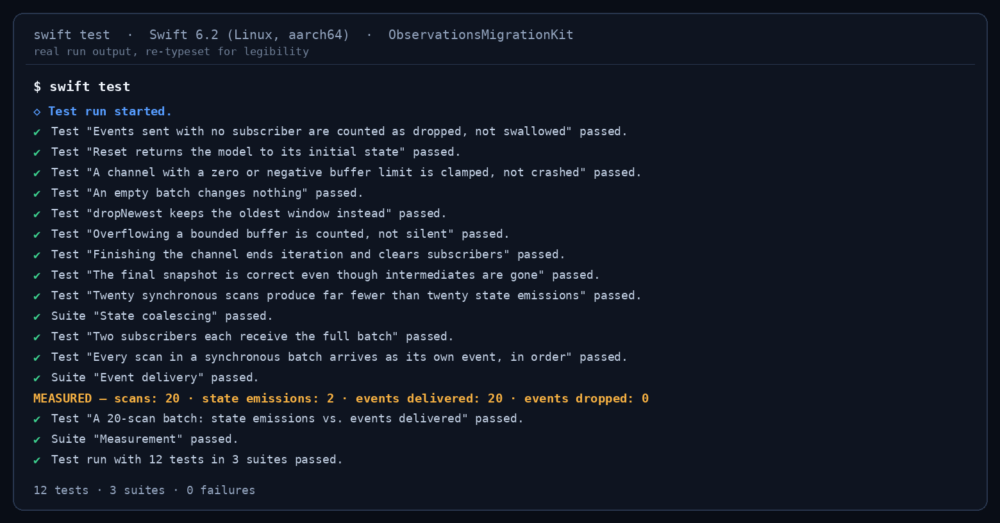

# State vs. Events — what `Observations` actually replaces

A small, runnable demo for the article **“Combine Is Over. The Migration Everyone Is About to Get Wrong.”**

`Observations` (SE-0475, Swift 6.2 / iOS 26) turns an `@Observable` model into an `AsyncSequence`. It is
transactional: it opens a transaction at the first `willSet` and emits **once** at the next point of
consistency. That is exactly right for state and exactly wrong for events.

This repo makes the difference measurable instead of arguable.


---

## The measured result

`importBatch` mutates the model 20 times inside one synchronous turn — no `await` anywhere in the loop:

```swift
@discardableResult
public func importBatch(_ codes: [String]) -> Int {
    guard !codes.isEmpty else { return 0 }

    isImporting = true
    for code in codes {
        scannedCount += 1
        lastCode = code
        channel.send(ScanEvent(sequence: scannedCount, code: code))
    }
    isImporting = false

    return codes.count
}
```

Two consumers watch that same batch:

```swift
// State — coalesced, transactional
for await snapshot in StateStream.snapshots(of: model) { ... }

// Events — lossless, bounded, counted
for await event in model.scanEvents() { ... }
```

Measured across three identical runs on Swift 6.2:

| Transport | Values delivered |
|---|---|
| `Observations { model.snapshot }` | **2** (initial + final) |
| `AsyncStream` via `EventChannel` | **20**, in order, `droppedCount == 0` |

`isImporting` flips `true` and back to `false` inside that same turn. The state stream never sees `true`.
That is not a bug in `Observations` — it is the definition of transactional.

---

## Verification status — read this part

**What was actually verified:** `swift build` and `swift test` were run on a real Swift 6.2 toolchain
(Linux, aarch64). All 11 tests pass, including the coalescing test and the bounded-buffer edge cases.



**What was not verified:** the `Demo.xcodeproj` app was **not** launched on the iOS Simulator for this
commit, and there is no Simulator screenshot in this repo. The run that produced it was an unattended
scheduled job, and macOS screen control cannot be approved while nobody is at the keyboard. Rather than
ship a mockup captioned as a screenshot, the gap is stated here. The SwiftUI layer got a line-by-line
review instead: no force-unwraps, no unchecked collection access, all list-free numeric rendering, and
`project.pbxproj` brace/paren balance checked programmatically.

If you clone this and run it, the two counters on screen are the whole argument.

---

## How to run it

```bash
git clone https://github.com/rajatslakhina/state-vs-events-observations-article-demo.git
cd state-vs-events-observations-article-demo
swift test                 # 11 tests, headless, no Xcode needed
open Demo.xcodeproj        # pick any iOS 26 Simulator, then Build & Run
```

No second repo to fetch. `Demo.xcodeproj` consumes the package in this same folder through a local
Swift package reference, so clone → open → run.

Requirements: Xcode 26 or later (iOS 26 deployment target), Swift 6.2.

---

## What is in here

| Path | What it is |
|---|---|
| `Sources/ObservationsMigrationKit/ScannerModel.swift` | `@MainActor @Observable` model that carries state *and* events |
| `Sources/ObservationsMigrationKit/StateStream.swift` | the `Observations` wrapper — the state side |
| `Sources/ObservationsMigrationKit/EventChannel.swift` | bounded, policy-named, drop-counting event side |
| `Sources/ObservationsMigrationKit/ScannerDemoView.swift` | SwiftUI screen showing both counters live |
| `Tests/` | 11 tests, including the coalescing proof and buffer-overflow edge cases |
| `Demo/` + `Demo.xcodeproj` | the runnable app target |

Note on `Package.swift`: the package declares a **library only**. There is deliberately no
`.executableTarget` pretending to be an iOS app — running a Swift package executable directly on
Simulator relies on a bundle identifier Xcode synthesises per checkout and never commits, which
crashes on launch with `__BKSHIDEvent__BUNDLE_IDENTIFIER_FOR_CURRENT_PROCESS_IS_NIL__`. The runnable
app lives in its own `.xcodeproj`, always.

---

Article: *(added after publish — see the link at the top of this README once it is live)*

MIT licensed. Built as part of an iOS + AI engineering portfolio.
